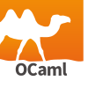

# Hello, World!

The aim of this repository is to invite everyone to add their **Hello, World!** in all language you program.

## How to?

To add your Hello, World! follow these 3 steps:

- Create a fork of this repository.

- Add your Hello, World! in the languages you master. _**See What I need to change in the code?**_

- Finally, make a pull request and add a ⭐!

# What I need to change in the code?

## <picture></picture>&nbsp;C

You need to add this text in the int main() function.

```c
printf("Hello, World! by UserName");
```

## <picture></picture>&nbsp;C++

You need to add this text in the int main() function.

```cpp
std::cout << "Hello, World! by UserName" << std::endl;
```

## <picture></picture>&nbsp;Python

You need to add this text at the end of the file.

```python
print("Hello, World! by UserName")
```

## <picture></picture>&nbsp;HTML

You need to add this text in the \<body\> container.

```html
<p>Hello, World! by UserName</p>
```

## <picture></picture>&nbsp;Rust

You need to add this text in the main function.

```rust
println!("Hello, World! by UserName");
```

## <picture></picture>&nbsp;Ocaml

You need to add this expression in your script.

```ocaml
print_endline "Hello, World! by UserName"
```
